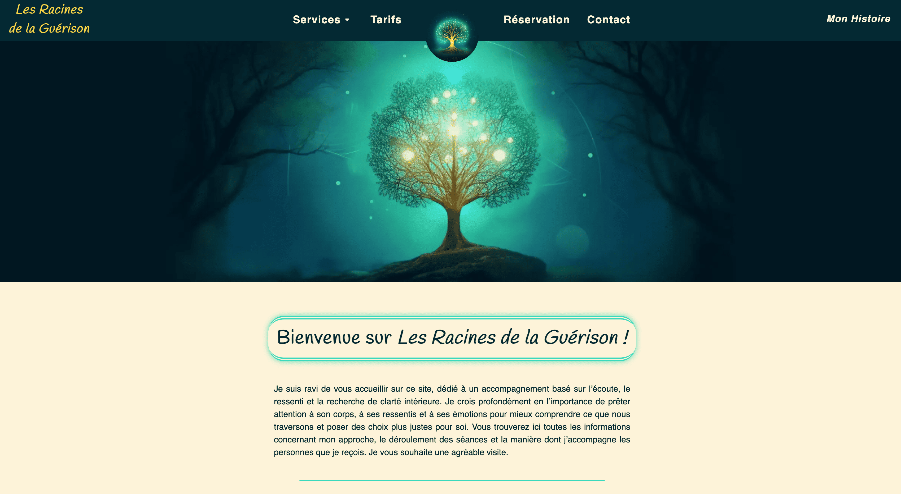
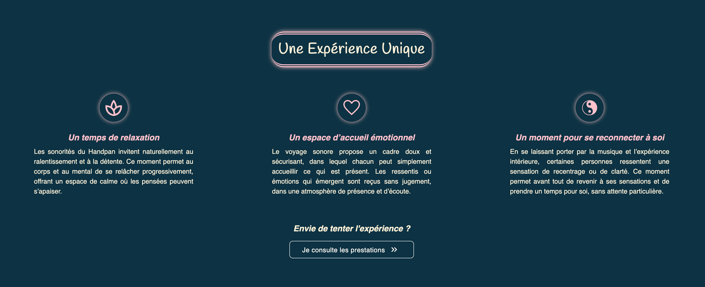

# Healing Roots Website

## Overview

Healing Roots is a website designed for a therapeutic activity focused on helping people navigate periods of life transition and regain inner stability.

The objective of the project was to create a calm, accessible and reassuring digital experience, translating a human-centered approach into a clear and minimalist interface.

This project was fully designed and developed as a real-world product, from visual structure to technical implementation.

Designed and developed entirely by myself, from UX structure to technical implementation.

---

## Live Demo

👉 [Visit the live website](https://racines-guerison.com)

---

## Screenshots

Main pages of the website illustrating the visual direction and user experience.




---

## Goals

- Present a therapeutic activity in a simple and understandable way
- Create a peaceful and distraction-free user experience
- Ensure readability and accessibility across devices
- Build a fast and maintainable website

---

## Tech Stack

- Next.js / React
- JavaScript / TypeScript
- Responsive CSS and Tailwind
- SEO-oriented structure
- Git versioning

---

## Features

- Responsive design (mobile-first approach)
- Clear navigation and content hierarchy
- Optimized performance
- Contact and presentation pages
- Simple and scalable structure for future evolution

---

## Technical Focus

This project focuses on:

- Translating an emotional and human intention into UI decisions
- Maintaining simplicity in both design and code structure
- Creating reusable components
- Ensuring long-term maintainability
- Special attention was given to performance optimization, image loading and accessibility to ensure a smooth experience on mobile devices.

---

## Installation

```bash
git clone https://github.com/robinPoncon/healing-roots-website.git
cd healing-roots-website
npm install
npm run dev

```
